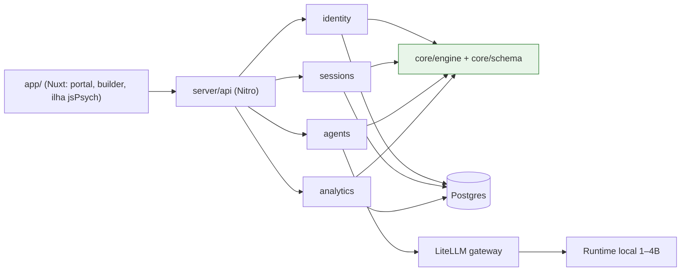
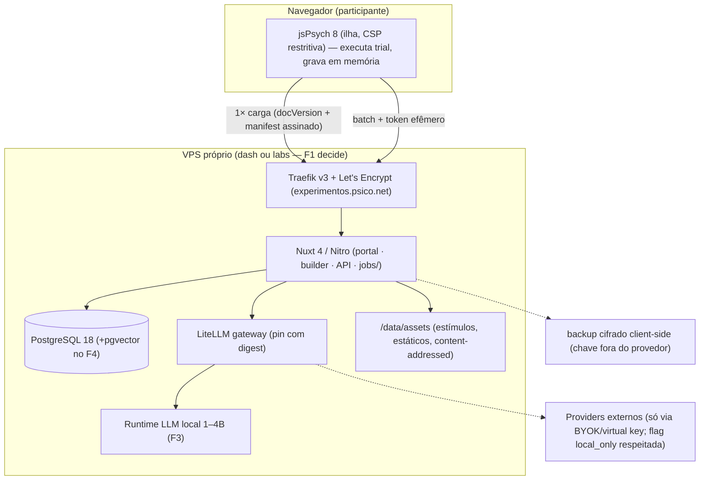
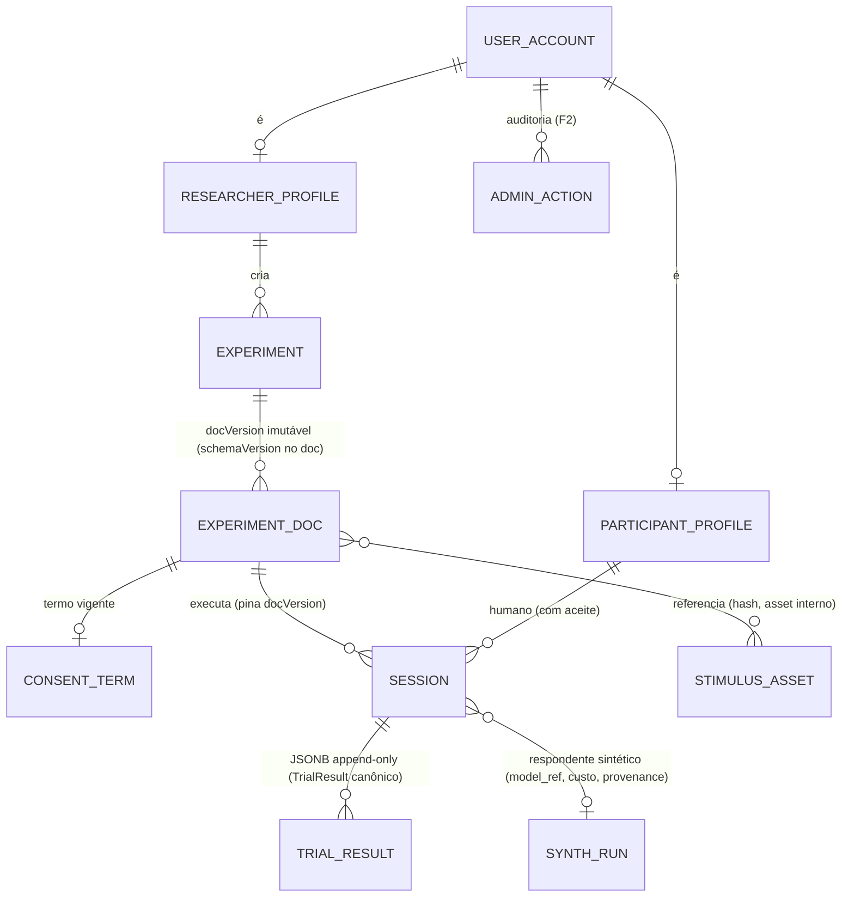

# Architecture Spine — Plataforma de Experimentos Psicológicos

## Design Paradigm

**Modular monolith com ports & adapters (hexagonal leve)**, hospedado no server Nitro do
Nuxt 4 (um artefato deployável, um VPS de 8 GB).

- **Núcleo** (`core/`): schema do experimento + motor procedural (blocos, critério,
  embaralhamento, RNG) — puro, sem HTTP, sem DOM, sem LLM SDK.
- **Adapters de respondente** (port único `RespondentPort`): jsPsych (humano, no
  navegador) e prompt/LLM (sintético, no servidor).
- **Adapters de infra**: Postgres, assets de estímulos, gateway de LLM, e-mail.

As três fronteiras que o paradigma protege: **motor procedural no núcleo** (AD-2),
**contrato de resultado canônico** (AD-3) e **gateway de inferência único** (AD-8).

## Invariants & Rules

### AD-1 — Modular monolith hexagonal leve no Nitro

- **Binds:** all
- **Prevents:** um VPS de 8 GB virar uma frota de serviços; duplicação de auth/config entre front e back
- **Rule:** uma unidade deployável (Nuxt 4: app + Nitro server). `core/` não importa nada de
  `app/`, `server/` ou de SDKs de infra; dependências sempre apontam da borda para o centro.



### AD-2 — Motor procedural pertence ao núcleo

- **Binds:** motor-experimentos, participantes-sinteticos
- **Prevents:** divergência procedural entre humano e sintético (loops de bloco, critério de mastery, re-embaralhamento, RNG) — o fork procedimental que tornaria o benchmark humano×modelo não comparável
- **Rule:** `core/engine` executa a sequência procedural (blocos, critério, repetições,
  shuffle com **seed registrada na sessão**); adapters apenas renderizam estímulos e
  coletam respostas. A mesma seed + o mesmo schema produzem a mesma sequência para
  qualquer respondente.

### AD-3 — Port `RespondentPort` + `TrialResult` canônico versionado

- **Binds:** motor-experimentos, participantes-sinteticos, dados-sessoes
- **Prevents:** humano e sintético gravarem shapes incompatíveis (rt humano vs latência de inferência, estímulo por URL vs hash) — a comparação F5 quebraria na primeira query
- **Rule:** o contrato vive em `core/schema` como tipos versionados: `TrialResult` com
  `respondent_class` (human|synthetic), `trial_seq`, estímulo por **hash do asset**,
  resposta, acerto; `timing` (rt, cliques) obrigatório e completo só no ramo human;
  `inference` (model_ref, latency, cost, provenance da rota) só no ramo synthetic.
  Validação na ingestão — resultado fora do contrato não entra na sessão.

### AD-4 — Schema versionado, documento imutável

- **Binds:** autoria, motor-experimentos, dados-sessoes
- **Prevents:** lock-in do formato jsPsych; experimento mutando sob uma sessão em curso; resultados irreproduzíveis
- **Rule:** `schemaVersion` = contrato do formato (JSON Schema versionado, superset do
  formato PyMTS; mudança incompatível = nova versão + migração explícita) ≠ `docVersion` =
  snapshot imutável do documento do experimento. A sessão **pina `docVersion`**; a
  timeline jsPsych e os prompts do sintético são **gerados** do documento pinado,
  nunca armazenados como formato primário. Validação na criação e na carga.

### AD-5 — Sessão como unidade de escrita, resultado append-only, owner único

- **Binds:** dados-sessoes, participantes-sinteticos
- **Prevents:** dois caminhos de mutação do dado científico; owner indefinido quando o runner sintético escreve
- **Rule:** todo registro de sessão — humano **ou sintético** — é escrito pelo módulo
  `sessions` (o runner sintético vive em `server/jobs/` com credencial de serviço e só
  escreve pelo port de `sessions`). Trials de resultado são JSONB append-only; após
  fechamento, imutáveis — correção gera novo registro referenciando o original. Upload
  em batch é **idempotente** (idempotency key por checkpoint).

### AD-6 — Segregação de PII e pseudonimização com dissociação programada

- **Binds:** portal-registro, dados-sessoes, resultados, agentes-assistidos, participantes-sinteticos
- **Prevents:** PII em exports, logs, analytics e prompts; dois módulos derivarem identificadores de formas diferentes
- **Rule:** `anonymized_id` é **HMAC keyed + salt por experimento**, emitido exclusivamente
  pelo módulo `identity`; o mapping vive segregado por role, acessível só ao processo
  auditado de direitos do titular (AD-13). A **classe protegida** = PII direta +
  demográficos + texto livre com potencial identificador (respostas projetivas incluídas).
  Registro honesto: enquanto o mapping existe, o dado é **pseudonimizado** (LGPD aplica);
  ao fim do estudo (ou a pedido), a **dissociação é irreversível** — chave do HMAC do
  experimento destruída, mapping eliminado. Análise, exports e prompts só enxergam o
  pseudônimo; o join PII×resultado não existe como consulta de aplicação.

### AD-7 — Caminho do participante é estático após carga

- **Binds:** motor-experimentos, operacao
- **Prevents:** acoplamento latência-banco no meio do trial (letal se app e DB vierem a hosts distintos); escala cara de participantes
- **Rule:** carregar experimento = 1 request (documento pinado + manifest de assets com
  URLs **geradas pelo servidor**); entre trials, zero chamadas; resultado gravado em batch
  no fim (ou checkpoints explícitos). jsPsych roda offline-durante-execução por desenho.

### AD-8 — Gateway de inferência único (LiteLLM), privacidade e custo por sessão

- **Binds:** agentes-assistidos, participantes-sinteticos
- **Prevents:** chaves espalhadas; custo desgovernado; chamadas externas sem controle de transferência
- **Rule:** nenhum módulo chama provider diretamente — tudo via LiteLLM. Chaves
  (BYOK/plataforma) só server-side; roteamento respeita flag **`local_only`** do
  experimento (transferência internacional só com termo que enumere provedor; dado enviado
  é sempre da classe pseudonimizada). Toda run sintética grada provenance na sessão
  (model, provider, rota) e **custo**; spend caps por pesquisador via virtual keys.
  Versão do LiteLLM **pinada com digest** (incidente supply-chain mar/2026 — 1.82.7/.8;
  nunca `latest`).

### AD-9 — Consentimento versionado como gate de fluxo (humanas)

- **Binds:** portal-registro, dados-sessoes
- **Prevents:** coleta sob termo vencido; benchmark sintético travado por termo novo
- **Rule:** sessão **humana** nasce com evento de aceite referenciando a versão do termo;
  nova versão invalida apenas a criação de novas sessões humanas. Sessão **sintética**
  referencia o termo vigente como metadado (sem aceite); não é bloqueada por troca de termo.

### AD-10 — Estímulos são referências internas, resolução por manifest

- **Binds:** dados-sessoes, autoria
- **Prevents:** banco/backup inchados; SSRF e vazamento de IP do participante via URL externa; injeção de script via estímulo
- **Rule:** estímulos são assets **internos** content-addressed (hash no nome), servidos
  como estáticos ou URL assinada gerada pelo servidor; o schema **proíbe** script inline
  e URL externa em estímulo/consequência; a ilha jsPsych roda com CSP restritiva
  (sem execução arbitrária de HTML).

### AD-11 — Autenticação de coleta por token efêmero

- **Binds:** dados-sessoes, motor-experimentos
- **Prevents:** forjar dado científico postando batch com session_id adivinhado (UUIDv7 não é secreto)
- **Rule:** a criação da sessão emite token de upload **HMAC com TTL da sessão**,
  verificável no batch; sem token válido, o resultado não entra. APIs de pesquisador
  usam token curto escopado; participante usa cookie httpOnly de sessão.

### AD-12 — Chaves BYOK com envelope encryption

- **Binds:** agentes-assistidos
- **Prevents:** cifra decorativa (master key no mesmo VPS que o dado)
- **Rule:** BYOK cifrada com envelope encryption — master key provisionada **fora do VPS**
  (segredo de deploy/segundo ambiente), nunca em env do container; LiteLLM opera com
  virtual keys derivadas, com spend cap por pesquisador. MFA obrigatório para admin.

### AD-13 — Direitos do titular endereçados por desenho

- **Binds:** admin-auditoria, dados-sessoes
- **Prevents:** tensão não resolvida entre imutabilidade científica (AD-5 append-only) e art. 18 VI LGPD (eliminação)
- **Rule:** eliminação/anonimização a pedido = remover PII + destruir a chave HMAC do
  experimento correspondente ao mapping do titular; trials preservados **somente se
  irreversivelmente dissociados** (art. 16). Fluxo operado exclusivamente por `identity`,
  com trilha de auditoria. Retenção e portabilidade definidas na política (open no F1).

### AD-14 — Vetorial dentro do Postgres (pgvector)

- **Binds:** resultados (F4)
- **Prevents:** +1 serviço stateful no VPS sem necessidade
- **Rule:** embeddings/busca semântica no mesmo Postgres (pgvector) enquanto a escala permitir; serviço dedicado só com limite medido.

### AD-15 — Ambientes e pipeline mínimos

- **Binds:** operacao
- **Prevents:** "dev não parece prod" e deploy artesanal divergente entre fases
- **Rule:** dev = docker compose local **espelhando prod** (mesmo desenho, dados sintéticos);
  prod = VPS único + Traefik + compose (via Dokploy/Ansible do ambiente); sem staging no
  horizonte F0–F2. CI no repo: lint + testes a cada push (GitHub Actions). Backup externo
  **cifrado client-side** (provedor só vê ciphertext sem chave — compatível com a restrição
  "dado sensível não sai em claro").

## Consistency Conventions

| Concern | Convention |
| --- | --- |
| Naming | código/identificadores em inglês; UI/conteúdo em pt-BR; módulos singular minúsculo (`identity`, `sessions`) |
| Data & formats | IDs UUIDv7 (**nativo `uuidv7()` no PostgreSQL 18** — default de PK no banco); datas ISO-8601 UTC; erros HTTP RFC 9457 `application/problem+json`; experimento com `schemaVersion` + `docVersion` (AD-4) |
| State & cross-cutting | mutação de resultados só via `sessions` (AD-5); logs sem classe protegida (AD-6); config por env no `deploy/`; auth por AD-11 |
| Experimentos | unidade procedimental = bloco com critério (herança PyMTS); consequências diferenciais por tentativa; SMTS/DMTS configurável por bloco; seed de RNG na sessão (AD-2) |
| Resultados ao participante | feedback **descritivo/educativo, nunca diagnóstico**; conteúdo do feedback definido pelo pesquisador dono do experimento [ASSUMPTION a confirmar] |
| RBAC | papéis participant/researcher/admin enforcement **server-side em cada rota Nitro** (middleware único, sem checks ad-hoc) |

## Stack

SEED — verificado em 2026-10-03 (memlog + reviews/version-check); o código assume a propriedade quando existir.

| Name | Version |
| --- | --- |
| TypeScript / Node.js | Node 22 LTS (26: LTS programada p/ 28/out/2026 — ainda Current; decidir 22 vs 26 no scaffold F0) |
| Nuxt (app + Nitro server) | 4.x estável |
| jsPsych + plugins `@jspsych/*` | 8.3.0 (todos pinados) |
| PostgreSQL | 18 (uuidv7 nativo) |
| pgvector | ≥0.8.7 (suporta PG18; quando F4) |
| LiteLLM (gateway) | self-host, pin com digest — 1.103.2 (01/out/2026) ou posterior auditada |
| Runtime LLM local | 1–4B quantizado, CPU (llama.cpp vs Ollama — aberto, F3) |
| Traefik | v3 (stack do ambiente) |
| SO/alvo | Debian 12, Docker Compose, VPS netcup 4 vCPU/8 GB |

## Structural Seed

### Containers & deploy (ambiente alvo — VPS único até prova contrária)



### Entidades centrais



### Árvore mínima

```text
Project-planner/
  projects/            # specs e decisões (existente — casa do projeto)
  docs/architecture/   # este spine + memlog + reviews
  plataforma/          # código nasce na F0 (Nuxt 4 monorepo)
    app/               # portal, builder, ilha jsPsych
    server/api/        # rotas Nitro: identity, sessions, agents, analytics
    server/jobs/       # runner sintético (credencial de serviço; escreve via sessions)
    core/schema/       # JSON Schema do experimento + contrato TrialResult (contrato c/ projeto 02)
    core/engine/       # motor procedural respondente-agnóstico (AD-2)
    core/adapters/     # jspsych/ (timeline), synthetic/ (prompt+parse)
    db/migrations/
    deploy/            # compose, traefik, envs, backup
```

## Capability → Architecture Map

| Capability / Area | Lives in | Governed by |
| --- | --- | --- |
| Portal público + registro (F1–F2) | `app/` portal + `server/api/identity` | AD-1, AD-6, AD-9 |
| Identidade e papéis (RBAC) | `server/api/identity` | AD-6, AD-12, AD-13; convenção RBAC |
| Execução de experimentos (humano) | `app/` ilha jsPsych + `core/adapters/jspsych` | AD-2, AD-3, AD-4, AD-7, AD-10, AD-11 |
| Autoria de experimentos | `app/` builder + `core/schema` | AD-4, AD-10 |
| Dados e sessões | `server/api/sessions` + Postgres | AD-3, AD-5, AD-7, AD-9, AD-11 |
| Resultados/relatórios | `server/api/analytics` (views SQL) | AD-3, AD-5; convenção feedback |
| Agentes assistidos (F3) | `server/api/agents` → LiteLLM | AD-6, AD-8, AD-12 |
| Participantes sintéticos (F5) | `server/jobs/` + `core/adapters/synthetic` | AD-2, AD-3, AD-5, AD-8, AD-9 |
| Admin e auditoria (F2) | `server/api/identity` + `admin_actions` | AD-12, AD-13 |
| Operação (deploy, ambientes, backup, CI) | `deploy/` + Traefik | AD-15; gate Track C (reset VPS) |

## Deferred

- **Qual VPS (dash vs labs)** — geografia vs carga; decisão na F1 com medição (§4 do 03a).
- **Auth própria vs Supabase self-hosted** — default F1: Postgres + auth leve no Nitro
  [ASSUMPTION]; reavaliar Supabase quando RLS granular/storage/realtime pesarem.
- **Runtime de modelos locais (llama.cpp vs Ollama)** — F3; exceção dedicada à decisão
  "não redeployar Ollama" (OZP-81).
- **Métrica do benchmark sintético** — questão científica (F5): distribuição de respostas
  vs normas humanas é a primeira candidata.
- **Política de retenção e portabilidade** (detalhe do AD-13) — F1, com revisão jurídica.
- **UI de builder** — riqueza (drag&drop + preview) vs formulário config-first; se cortar
  do MVP, HTMX volta a ser opção de frontend (gatilho no 03a §4b).
- **Detalhe de estímulo multimodal para sintéticos** (projetivos com imagem → LLM vision):
  mecanismo de apresentação no prompt — F5, sobre AD-3/AD-10.
